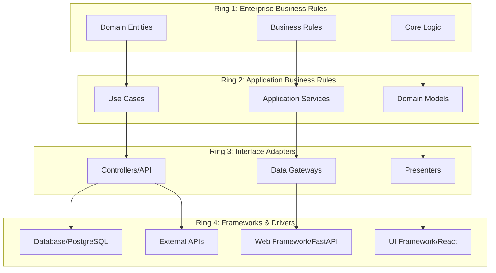
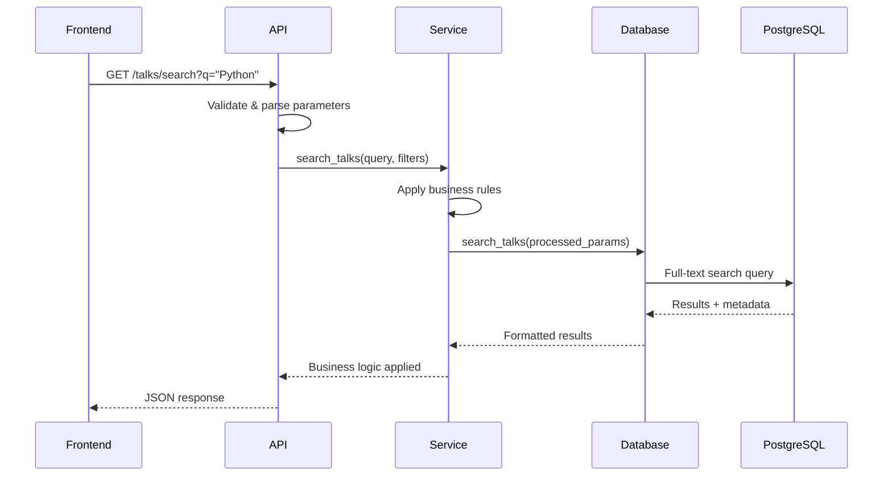
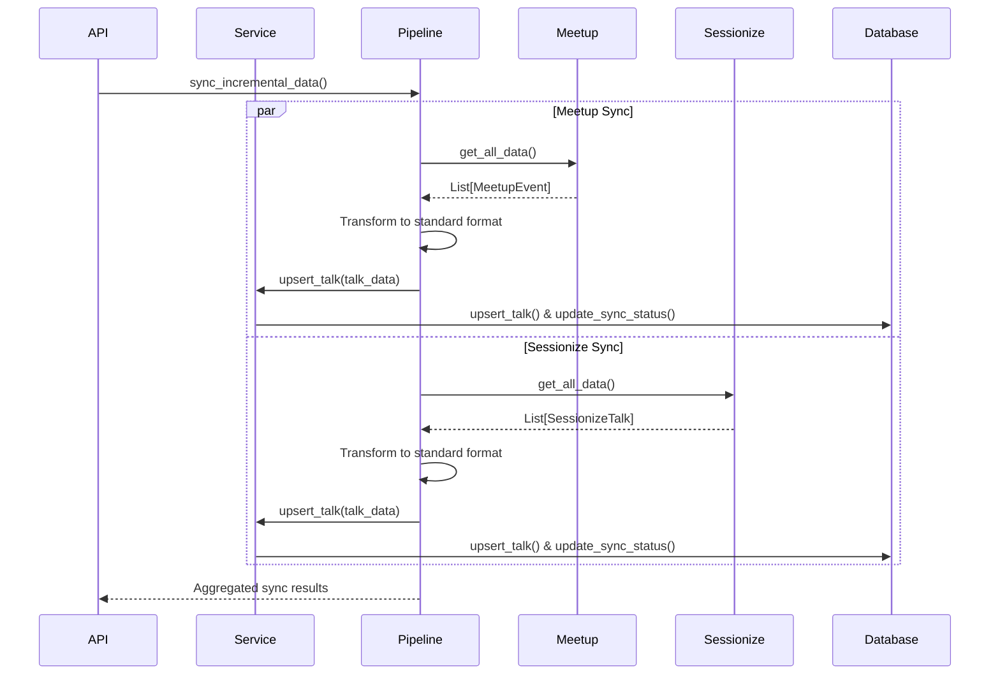
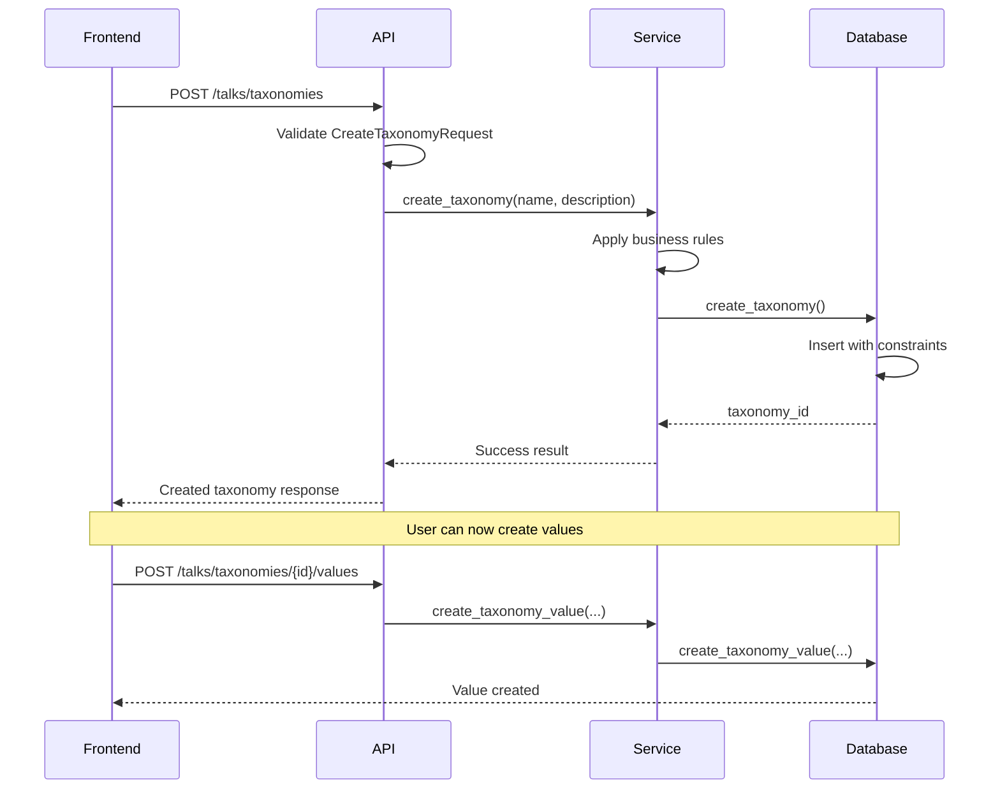

# Architecture Documentation

## Overview

The Python Ireland Talk Database follows **Clean Architecture** principles, ensuring separation of concerns, testability, and maintainability. The system is designed around concentric rings where inner rings contain business logic and outer rings contain implementation details.



## Directory Structure Reality Check

### **Current Structure:**

```
backend/domain/         # 🚨 MISNAMED: Contains DTOs, not domain entities
backend/services/       # ✅ CORRECT: Application business rules
backend/api/            # ✅ CORRECT: Interface adapters (controllers)
backend/database/       # ✅ CORRECT: Interface adapters (data gateways)
lib/engine/             # 🚨 MIXED: Business logic + external drivers
frontend/               # ✅ CORRECT: Frameworks & drivers
```

### **Proper Clean Architecture Mapping:**

```
Ring 1: lib/engine/data_pipeline.py (business methods only)
Ring 2: backend/services/
Ring 3: backend/api/ + backend/database/ + backend/domain/models.py
Ring 4: lib/engine/meetup.py + lib/engine/sessionize.py + PostgreSQL + React
```

### **Ideal Structure (Future):**

```
backend/core/entities.py       # Ring 1: Pure domain entities
backend/core/services.py       # Ring 1: Pure business logic
backend/usecases/              # Ring 2: Application business rules
backend/adapters/api/          # Ring 3: HTTP controllers
backend/adapters/database/     # Ring 3: Data gateways
backend/contracts/             # Ring 3: DTOs and interfaces
lib/drivers/                   # Ring 4: External service clients
```

---

## Current Implementation Analysis

**Note:** Our current codebase doesn't perfectly align with textbook Clean Architecture. Here's the honest mapping of what we actually have:

---

## Ring 1: Enterprise Business Rules

**⚠️ Currently Mixed/Scattered** - This is our weakest ring in terms of Clean Architecture adherence.

**Pure Business Logic Found In:**

- `lib/engine/data_pipeline.py` (transformation algorithms):
  ```python
  def _convert_meetup_to_talk(event) -> Dict        # Business transformation
  def _convert_sessionize_to_talk(talk) -> Dict     # Business transformation
  def _should_update_talk(existing, new) -> bool    # Business rules
  def _extract_auto_tags(title, description) -> List[str]  # Content analysis
  ```

**What's Missing:** True domain entities with behavior. Our current "entities" are just data containers.

**Ideal Ring 1 (Future Refactoring):**

```python
# Should have: backend/core/entities.py
class Talk:
    """Rich domain entity with business behavior"""
    def add_taxonomy_value(self, value: TaxonomyValue) -> None:
        # Business rule enforcement

    def is_eligible_for_auto_tagging(self) -> bool:
        # Business logic

class Taxonomy:
    """Classification business entity"""
    def add_value(self, value: str) -> TaxonomyValue:
        # Business validation
```

---

## Ring 2: Application Business Rules

**Location:** `backend/services/talk_service.py`

This is our strongest Clean Architecture implementation - proper use case orchestration.

### Application Services (`backend/services/talk_service.py`)

Well-implemented application layer coordinating business operations:

```python
class TalkService:
    """Application layer coordinating business operations"""

    # Talk lifecycle use cases
    def create_talk(talk_data: Dict) -> str
    def get_talk(talk_id: str) -> Optional[Dict]
    def search_talks(...) -> Tuple[List[Dict], int]

    # Taxonomy management use cases
    def create_taxonomy(name: str, description: str) -> int
    def create_taxonomy_value(...) -> int
    def initialize_default_taxonomies() -> None

    # Synchronization use cases
    def get_sync_status(source_type: str) -> Optional[Dict]
    def update_sync_status(...) -> bool
    def upsert_talk(talk_data: Dict) -> Optional[str]
    def get_talk_by_source(...) -> Optional[Dict]
```

**Key Responsibilities:**

- Use case coordination ✅
- Business rule enforcement ✅
- Data format translation ✅
- Cross-cutting concerns (logging, validation) ✅

---

## Ring 3: Interface Adapters

**Locations:** `backend/api/`, `backend/database/`, `backend/domain/models.py`

### **3a. HTTP Controllers** (`backend/api/routers/talks.py`)

Properly implemented REST interface:

```python
# Core domain entities
class TalkType(str, Enum): ...
class BaseTalk(BaseModel): ...
class PyConTalk(BaseTalk): ...
class MeetupTalk(BaseTalk): ...

# Search and filtering
class TalkSearch(BaseModel): ...

# Taxonomy management
class CreateTaxonomyRequest(BaseModel): ...
class UpdateTaxonomyRequest(BaseModel): ...
```

**Design Principles:**

- Framework-independent (Pydantic only)
- Immutable data structures
- Rich domain models with validation
- Type safety throughout

### Application Services (`backend/services/talk_service.py`)

Orchestrates business operations and enforces application rules:

```python
class TalkService:
    """Application layer coordinating business operations"""

    # Talk lifecycle
    def create_talk(talk_data: Dict) -> str
    def get_talk(talk_id: str) -> Optional[Dict]
    def search_talks(...) -> Tuple[List[Dict], int]

    # Taxonomy management
    def create_taxonomy(name: str, description: str) -> int
    def create_taxonomy_value(...) -> int
    def initialize_default_taxonomies() -> None

    # Synchronization management
    def get_sync_status(source_type: str) -> Optional[Dict]
    def update_sync_status(...) -> bool
    def upsert_talk(talk_data: Dict) -> Optional[str]
    def get_talk_by_source(...) -> Optional[Dict]
```

**Key Responsibilities:**

- Use case coordination
- Business rule enforcement
- Data format translation
- Cross-cutting concerns (logging, validation)

---

## Ring 3: Interface Adapters

**Locations:** `backend/api/`, `backend/database/`

Adapters that translate between the application core and external interfaces.

### HTTP API Controllers (`backend/api/routers/talks.py`)

RESTful HTTP interface translating web requests to use cases:

````python
```python
# Talk operations
GET    /talks/                     # List talks with filtering
GET    /talks/search               # Full-text search
GET    /talks/{id}                 # Get specific talk
GET    /talks/events               # List available events
GET    /talks/tags                 # List available tags

# Taxonomy management
GET    /talks/taxonomies           # List taxonomies
POST   /talks/taxonomies           # Create taxonomy
PUT    /talks/taxonomies/{id}      # Update taxonomy
DELETE /talks/taxonomies/{id}      # Delete taxonomy

# Synchronization
POST   /talks/sync                 # Trigger incremental sync
GET    /talks/sync/status          # Get sync status
GET    /talks/sync/status/{source} # Get source-specific status

# Administrative
POST   /talks/ingest               # Full data ingestion
DELETE /talks/all                  # Clear all data
GET    /talks/health               # Health check
````

### **3b. Request/Response DTOs** (`backend/domain/models.py`)

**⚠️ Naming Issue:** These are actually Interface Adapters (DTOs), not Domain Entities:

```python
# These are API contracts/DTOs, NOT domain entities
class CreateTaxonomyRequest(BaseModel): ...   # HTTP request DTO
class TalkSearch(BaseModel): ...              # Search parameters DTO
class BaseTalk(BaseModel): ...                # Response DTO
```

**Better Name:** Should be `backend/contracts/` or `backend/dtos/`

### **3c. Database Gateway** (`backend/database/postgres_client.py`)

PostgreSQL-specific implementation translating application data to database operations:

```python
class PostgresClient:
    """PostgreSQL adapter implementing data persistence"""

    # CRUD operations
    def index_talk(talk_data: Dict) -> str
    def get_talk(talk_id: str) -> Optional[Dict]
    def search_talks(...) -> Tuple[List[Dict], int]
    def delete_all_talks() -> bool

    # Advanced search
    def search_talks_advanced(...) -> Tuple[List[Dict], int]

    # Taxonomy operations
    def create_taxonomy(...) -> Optional[int]
    def get_taxonomies() -> List[Dict]
    def create_taxonomy_value(...) -> Optional[int]

    # Synchronization support
    def upsert_talk(talk_data: Dict) -> Optional[str]
    def get_talk_by_source(...) -> Optional[Dict]
    def get_sync_status(source_type: str) -> Optional[Dict]
    def update_sync_status(...) -> bool
```

**PostgreSQL-Specific Features:**

- Full-text search with GIN indexes
- JSONB storage for flexible schemas
- Complex relationship queries
- Performance optimizations
- Migration support

### **3d. Database Models** (`backend/database/models.py`)

SQLAlchemy ORM models - Infrastructure adapters for database persistence:

```python
# Core entities (SQLAlchemy ORM - Ring 3, NOT Ring 1)
class Talk(Base): ...              # Database schema mapping
class Taxonomy(Base): ...          # Table structure definition
class TaxonomyValue(Base): ...     # Relational constraints
class SyncStatus(Base): ...        # Persistence model

# Association tables
talk_taxonomy_values = Table(...)  # Many-to-many relationships
```

**Note:** These are database mapping models, not business entities.

---

## Ring 4: Frameworks & Drivers

**Locations:** External frameworks, databases, and UI components

### **4a. External API Clients** (`lib/engine/`)

**⚠️ Correctly Placed:** These belong in Ring 4, not Ring 1:

**Meetup Integration (`lib/engine/meetup.py`):**

```python
class Meetup:
    """External API client - Ring 4 driver"""
    def get_all_data() -> List[MeetupEvent]
    def get_group_events(group_name: str) -> List[MeetupEvent]
    # GraphQL API calls, HTTP requests, JSON parsing
```

**Sessionize Integration (`lib/engine/sessionize.py`):**

```python
class Sessionize:
    """External API client - Ring 4 driver"""
    def get_all_data() -> List[SessionizeTalk]
    def get_event_data(event_id: str) -> List[SessionizeTalk]
    # REST API calls, HTTP requests, JSON parsing
```

### **4b. Database (PostgreSQL)**

**Configuration:**

- PostgreSQL 15 with optimized settings
- Docker containerization for consistency
- Separate test database (port 5433)
- Performance tuning for full-text search

**Schema Design:**

```sql
-- Core tables
talks                 # Main talk storage with JSONB
taxonomies           # Classification categories
taxonomy_values      # Specific taxonomy values
sync_status          # Synchronization tracking

-- Association tables
talk_taxonomy_values # Many-to-many talk-tag relationships

-- Indexes
idx_talks_search     # GIN index for full-text search
idx_talks_type       # Talk type filtering
idx_talks_source     # Source-based queries
```

### Web Framework (FastAPI)

**Features:**

- Automatic OpenAPI documentation
- Async request handling
- Dependency injection system
- Pydantic integration for validation
- CORS middleware for frontend integration

**Configuration:**

```python
# Dependency injection
def get_talk_service() -> TalkService:
    return TalkService()

# Middleware
app.add_middleware(CORSMiddleware, ...)

# Route organization
app.include_router(talks_router, prefix="/api/v1/talks")
```

### Frontend (React + Vite)

**Architecture:**

```
src/
├── components/       # Reusable UI components
├── pages/           # Route-based page components
├── services/        # API client logic
├── contexts/        # React context providers
├── types/           # TypeScript type definitions
└── utils/           # Utility functions
```

**Technology Stack:**

- React 18 with TypeScript
- Material-UI for consistent design
- Vite for fast development builds
- Axios for API communication

---

## 📊 Architectural State Assessment

### ✅ **What We Do Well:**

- **Ring 2 (Use Cases):** `TalkService` is excellent Clean Architecture implementation
- **Ring 3 (Adapters):** Clear separation between API, database, and DTOs
- **Ring 4 (Drivers):** Proper framework usage and external service integration
- **Dependency Injection:** Well-implemented throughout the stack
- **Testing:** Good layer isolation with proper mocking

### ⚠️ **Areas for Improvement:**

- **Ring 1 (Entities):** Missing true domain entities with business behavior
- **Naming Convention:** `backend/domain/models.py` contains DTOs, not domain entities
- **Business Logic Location:** Some business rules scattered in `lib/engine/data_pipeline.py`

### 🎯 **Clean Architecture Score: 7/10**

Strong application layer and interface adapters, but missing pure domain entities.

### 🔄 **Potential Refactoring (Future):**

```bash
# Current problematic naming
backend/domain/models.py        # Actually contains DTOs

# Better structure would be:
backend/core/entities.py        # True domain entities with behavior
backend/contracts/dtos.py       # API request/response contracts
backend/services/               # Keep as-is (excellent)
backend/adapters/api/           # Renamed from backend/api/
backend/adapters/database/      # Renamed from backend/database/
```

---

## Data Flow Patterns

### 1. Search Request Flow



### 2. Data Synchronization Flow



### 3. Taxonomy Management Flow



---

## Testing Architecture

### Test Structure

```
tests/
├── conftest.py              # Shared fixtures and test configuration
├── test_ring1.py           # Enterprise business rules tests
├── test_postgres_client.py # Database layer tests
├── test_taxonomy_api.py    # API layer tests
├── test_taxonomy_service.py # Service layer tests
└── test_taxonomy_database.py # Database integration tests
```

### Test Database Management

**Automatic PostgreSQL Container:**

```python
@pytest.fixture(scope="session")
def ensure_test_db():
    """Automatically manages test PostgreSQL container"""
    # Start postgres:15 on port 5433
    # Wait for readiness
    # Yield for tests
    # Cleanup on completion
```

**Test Isolation:**

```python
@pytest.fixture
def postgres_client(test_database_url, ensure_test_db):
    """Provides clean database for each test"""
    client = PostgresClient(test_database_url)
    client.init_database()
    client.delete_all_talks()  # Clean slate
    yield client
    client.delete_all_talks()  # Cleanup
```

### FastAPI Testing

**In-Process Testing:**

```python
@pytest.fixture
def api_client(postgres_client):
    """FastAPI TestClient with dependency override"""
    app.dependency_overrides[get_talk_service] = lambda: TalkService(postgres_client)
    return TestClient(app)
```

**Benefits:**

- No network overhead (in-process)
- Real application code testing
- Dependency injection for isolation
- Fast execution

---

## Deployment Architecture

### Development Environment

**Docker Compose Setup:**

```yaml
services:
  postgres: # PostgreSQL 15 on port 5432
  backend: # FastAPI on port 8000
  frontend: # Vite dev server on port 5173
```

**Local Development:**

```bash
# Option 1: Full Docker
docker-compose up

# Option 2: Local dev + Docker DB
docker-compose up postgres -d
python -m backend.run      # Backend on 8000
npm run dev               # Frontend on 5173
```

### Production Considerations

**Database:**

- PostgreSQL with connection pooling
- Read replicas for scaling
- Backup and recovery procedures
- Performance monitoring

**API:**

- Load balancing for multiple instances
- Caching layer for frequent queries
- Rate limiting and authentication
- Monitoring and logging

**Frontend:**

- Static asset optimization
- CDN for global distribution
- Environment-specific configuration

---

## Key Design Decisions

### 1. Clean Architecture Adoption

**Why:** Ensures long-term maintainability and testability by enforcing dependency inversion and separation of concerns.

**Implementation:** Strict layering with dependency injection throughout.

### 2. PostgreSQL Over Elasticsearch

**Why:** Simplified deployment, better transaction support, native full-text search capabilities.

**Trade-offs:** Slightly more complex search queries but much simpler operational overhead.

### 3. Pydantic for Domain Models

**Why:** Type safety, automatic validation, excellent IDE support, framework independence.

**Benefits:** Catch errors early, self-documenting APIs, seamless JSON serialization.

### 4. FastAPI for HTTP Layer

**Why:** Modern async support, automatic documentation, excellent type integration.

**Benefits:** High performance, developer productivity, standards compliance.

### 5. Incremental Synchronization

**Why:** Efficient data updates, reduced API load, better user experience.

**Implementation:** Source tracking, timestamp comparison, differential updates.

---

## Extension Points

### Adding New Data Sources

1. **Create source adapter** in `lib/engine/new_source.py`
2. **Add transformation logic** in `DataPipeline`
3. **Update domain models** if needed
4. **Add sync tracking** in database
5. **Update API endpoints** for source-specific operations

### Adding New Features

1. **Define domain models** in `backend/domain/models.py`
2. **Implement use cases** in `backend/services/`
3. **Add database operations** in `backend/database/`
4. **Create API endpoints** in `backend/api/routers/`
5. **Update frontend** components

### Performance Optimizations

1. **Database indexing** for new query patterns
2. **Caching layer** for frequent operations
3. **Background jobs** for heavy processing
4. **API pagination** for large datasets
5. **Database query optimization**

This architecture provides a solid foundation for growth while maintaining code quality and system reliability.
