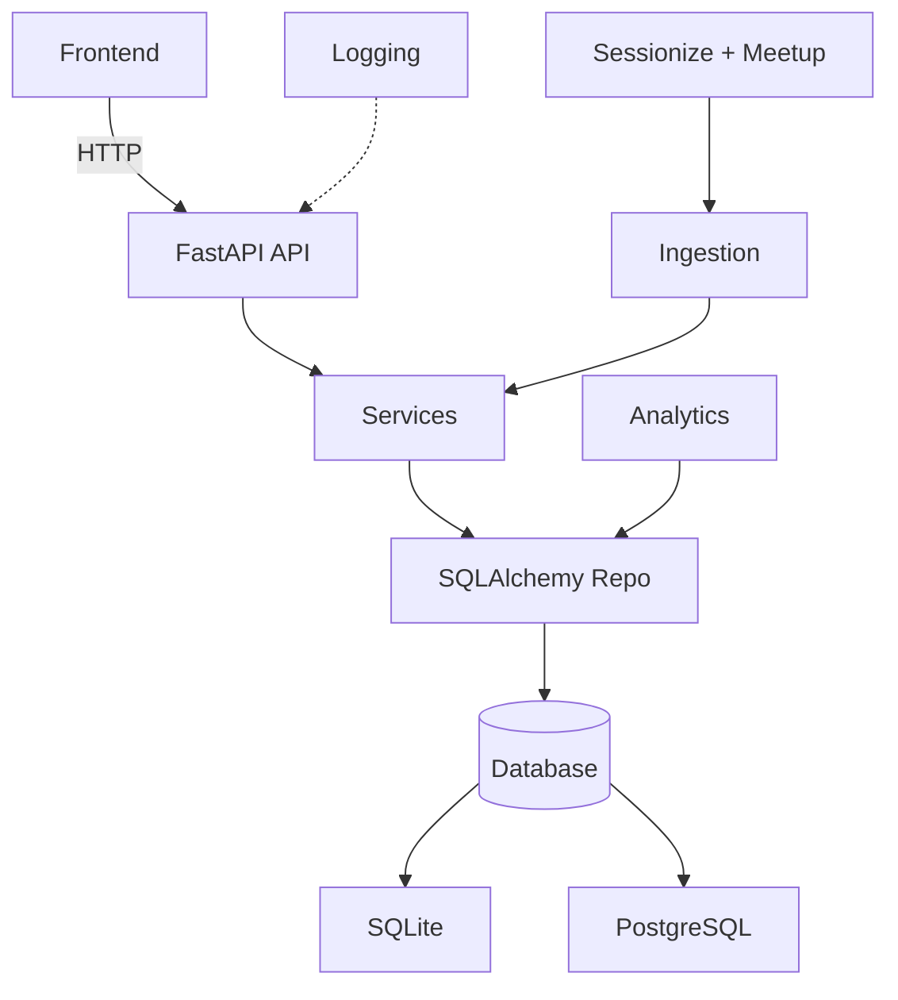
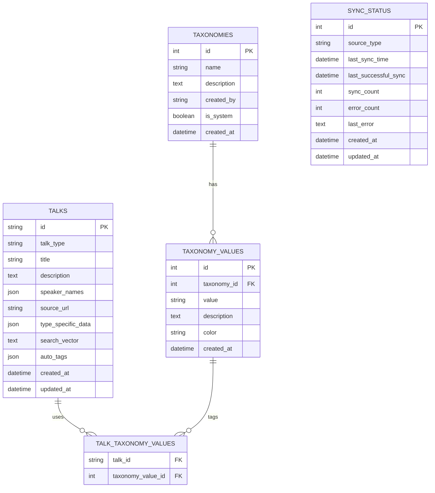

# Architecture Overview

This project uses a pragmatic layered design: thin HTTP routers (FastAPI), small application services, and a SQLAlchemy repository. Storage defaults to SQLite, with optional PostgreSQL for better full‑text search.

## System at a glance

```mermaid
flowchart TD
  A[Frontend] -->|HTTP| B[FastAPI API]
  B --> C[Services]
  C --> D[SQLAlchemy Repo]
  D --> E[(Database)]
  E --> F[SQLite]
  E --> G[PostgreSQL]
  H[Ingestion] --> C
  I[Sessionize + Meetup] --> H
  J[Analytics] --> D
  K[Logging] -.-> B
```

## Layers

- API (FastAPI): request validation, routing, response shape. See `backend/api/routers/*`.
- Services: light orchestration, auto‑tagging, resolving taxonomy name→ids. See `backend/app/service.py`.
- Repository: SQLAlchemy data access, search, analytics, ingest status. See `backend/db/repo.py`.
- Models: ORM entities and association table. See `backend/db/models.py`.

## Storage model

```mermaid
erDiagram
  TALKS {
    string id PK
    string talk_type
    string title
    text description
    json speaker_names
    string source_url
    json type_specific_data
    text search_vector
    json auto_tags
    datetime created_at
    datetime updated_at
  }
  TAXONOMIES {
    int id PK
    string name
    text description
    string created_by
    boolean is_system
    datetime created_at
  }
  TAXONOMY_VALUES {
    int id PK
    int taxonomy_id FK
    string value
    text description
    string color
    datetime created_at
  }
  TALK_TAXONOMY_VALUES {
    string talk_id FK
    int taxonomy_value_id FK
  }
  SYNC_STATUS {
    int id PK
    string source_type
    datetime last_sync_time
    datetime last_successful_sync
    int sync_count
    int error_count
    text last_error
    datetime created_at
    datetime updated_at
  }
  TALKS ||--o{ TALK_TAXONOMY_VALUES : uses
  TAXONOMY_VALUES ||--o{ TALK_TAXONOMY_VALUES : tags
  TAXONOMIES ||--o{ TAXONOMY_VALUES : has
```

Notes

- Talks to TaxonomyValues is many‑to‑many via `talk_taxonomy_values`.
- A uniqueness constraint exists for `(source_type, source_id)` to upsert from providers.

## Search behavior

- When using PostgreSQL, search leverages FTS: `to_tsvector` + `plainto_tsquery` over the `search_vector` column.
- On SQLite, search falls back to case‑insensitive LIKE across `search_vector`, `title`, and `description`.
- The repo rebuilds `search_vector` from key fields on create/update. Ranking on PG can be added with `ts_rank` later.

## Ingestion

- Providers: Sessionize (HTML scrape) and Meetup (GraphQL/HTTP). They produce talk payloads that the service saves via the repo.
- Full ingest runs for both providers; incremental sync currently reuses full. `sync_status` tracks per‑source runs/error state.
- Network can be disabled with `INGEST_DISABLE_NETWORK` to make CI deterministic.

## Technologies

- Python 3.11, FastAPI, Uvicorn
- SQLAlchemy 2.x, Alembic
- SQLite (default) or PostgreSQL (recommended for FTS)
- Vite/React frontend (scaffolded)
- Requests/BeautifulSoup (ingestion)

## Environments

- Default: SQLite `app.db` (no setup). For Postgres, set `DATABASE_URL` and run `make migrate`.
- Logging: `LOG_LEVEL` (INFO default) with X‑Request‑ID propagation in responses.

## Testing

- Tests run on SQLite via Pipenv/pytest. Legacy tests under `archive/` are excluded. See `pytest.ini`.
