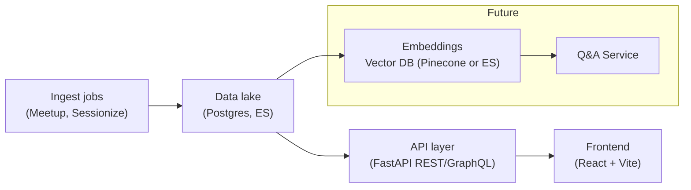

# python_ireland_talk_database

A modern “intelligence platform” for Python Ireland—aggregating all past talk and event metadata into a searchable, taggable, and analyzable system.

---

## 🎯 Vision & Phases

We’re building the first part in three iterative phases, with room to grow into a fuller information portal:

### Phase A: Talk Content Explorer

- **Goal:** Ingest Meetup & Sessionize data into Elasticsearch + Postgres, and build a React/Vite front‑end “Explorer”:
  - Filter by date, platform, full‑text search of titles & descriptions
  - Inline tagging of individual items
  - Detail drawer for full metadata (speakers, links, etc.)

### Phase B: Taxonomy Manager

- **Goal:** Curate the raw tags into a structured hierarchy:
  - Tag list with parent/child relationships
  - Drag‑and‑drop tree builder
  - Tag metadata (colors, descriptions, aliases)
  - Saved tag sets for quick filtering

### Phase C: Analytics Dashboard

- **Goal:** Slice & dice tagged content with charts and exports:
  - Tag distribution bar charts
  - Trends over time (multi‑line charts)
  - Co‑occurrence heatmaps
  - CSV/JSON export and alerts on tag‑volume changes

_Long‑term_, incorporate video data, extend this or add apps to integrate member/sponsor/speaker data (CRM) data, build a Q&A interface (with LLMs), and eventually package this as a drop‑in portal for other Python communities. Also could build a data lake to take full ownership of content, fly to the moon, etc.

---

## 🛠 Technology Stack

### Backend (Under Construction)

- **Framework:** FastAPI
- **Primary Store:** PostgreSQL (JSONB)
- **Search & Analytics:** Elasticsearch
- **ORM & Migrations:** SQLAlchemy + Alembic
- **Auth:** OAuth2 / JWT

### Frontend

- **Build Tool:** Vite v6.3.5
- **Library:** React v19.1.0 + TypeScript v5.8.3
- **UI Components:** MUI v7.1.1 (`@mui/material`, `@mui/lab`, `@mui/icons-material`)
- **Data Grid & Pickers:** `@mui/x-data-grid` v8.5.1, `@mui/x-date-pickers` v8.5.1
- **Styling:** Emotion v11.14.0
- **Charts:** Recharts v2.15.3
- **Routing:** React Router v7.6.2
- **Elasticsearch Client:** `@elastic/elasticsearch` (latest)
- **Dates:** date-fns v4.1.0

---

## 📦 Frontend: Install & Run

1. **Ensure Node 20+**:

   ```bash
   node --version   # should be 20.x

   ```

2. **Install dependencies**:

   ```bash
   cd frontend
   npm install
   ```

3. **Configure backend URL** (optional, defaults to http://localhost:8000):
   Create a .env:
   `bash
echo "VITE_BACKEND_URL=http://localhost:8000" > .env
`
4. **Run the development server**:
   ```bash
   npm run dev
   ```
   Open http://localhost:5173/explorer to see the skeleton Explorer page.

## Backend:

### Start Elasticsearch in Docker

#### Create the Elastisearch Docker network if you haven't already

```bash

# May need to limit memory for local dev at least, elastic is very memory hungry
docker run -d \
  --name elasticsearch \
  -p 9200:9200 \
  -e "discovery.type=single-node" \
  -e "xpack.security.enabled=false" \
  -e "ES_JAVA_OPTS=-Xms64m -Xmx128m" \
  -e "bootstrap.memory_lock=false" \
  -e "cluster.routing.allocation.disk.threshold_enabled=false" \
  --memory=256m \
  --memory-swap=256m \
  --cpus="0.25" \
  elasticsearch:8.11.0

```

#### Start Elasticsearch

```bash
docker start elasticsearch
curl http://localhost:9200/ #health check, should return a JSON response with cluster info
```

### Test the Data Retrieval Pipeline

#### 1. Start Elasticsearch If not Running

````bash
# lib/engine/elasticsearch_client.py - update README.md
## Test the Complete Pipeline


```bash
docker start elasticsearch
curl http://localhost:9200/  # Health check
````

#### 2. Start FastAPI Backend

```bash
pipenv install --dev # Install dependencies, just do once or when you expect changes
pipenv shell # Activate the virtual environment
cd backend
python run.py
```

### 3. Test Backend API & Frontend

```bash
# Health check
curl http://localhost:8000/api/v1/talks/health

# Ingest all data (Sessionize + Meetup)
curl -X POST http://localhost:8000/api/v1/talks/ingest

# Search all talks
curl http://localhost:8000/api/v1/talks/search

# Filter by type
curl "http://localhost:8000/api/v1/talks/search?talk_types=pycon"
curl "http://localhost:8000/api/v1/talks/search?talk_types=meetup"

# Search with query
curl "http://localhost:8000/api/v1/talks/search?q=django&talk_types=pycon&talk_types=meetup"

# Get available talk types
curl http://localhost:8000/api/v1/talks/types

# Run Frontend and browse talks in the Talk Explorer
# NB - you must run data ingestion step above first
cd frontend
npm run dev # Open http://localhost:5173/explorer
```

# Architecture



### LLM Integration (Future)

- **Goal:** Use LLMs to answer questions about the data, generate summaries, and provide insights.
