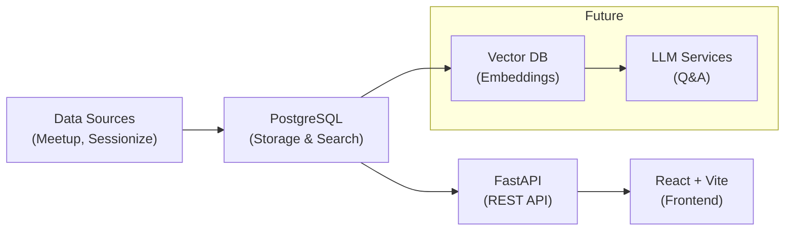

# Python Ireland Talk Database

A searchable database of Python Ireland conference talks and meetup events with intelligent tagging and filtering capabilities.

**🚀 Latest:** Migrated to PostgreSQL for enhanced tagging and simpler deployment!

---

## 🚀 Quick Start

Choose your preferred setup method:

### Option 1: Full Docker (Recommended)

**Perfect for:** First-time users, demos, consistent environments

```bash
# Start everything with one command
docker-compose up

# Visit the app at http://localhost:8000
# API docs at http://localhost:8000/docs
```

### Option 2: Local Development + Docker Database

**Perfect for:** Active development, faster iteration

```bash
# 1. Start just the database
docker-compose up postgres -d

# 2. Setup backend
pipenv install --dev && pipenv shell
python scripts/init_postgres.py
python -m backend.run

# 3. Setup frontend (new terminal)
cd frontend && npm install && npm run dev

# Backend: http://localhost:8000
# Frontend: http://localhost:5173
```

### Option 3: Manual Setup

**Perfect for:** Custom configurations, production deployments

Prerequisites: PostgreSQL, Python 3.11+, Node.js 20+

```bash
# Create database
createdb talks_db

# Configure environment
export DATABASE_URL="postgresql://localhost/talks_db"

# Follow Option 2 steps 2-3 above
```

---

## 🎯 Load Sample Data

After starting the backend:

```bash
# Load talks from conferences and meetups
curl -X POST http://localhost:8000/api/v1/talks/ingest

# Verify data loaded
curl http://localhost:8000/api/v1/talks/search
```

---

## 🛠 Technology Stack

**Backend:** FastAPI, PostgreSQL, Python 3.11  
**Frontend:** React, Vite, Material-UI, TypeScript  
**Data Sources:** Sessionize (PyCon events), Meetup API

---

## 🧪 Running Tests

```bash
# Run all tests (starts test database automatically)
pipenv run pytest

# Run specific test suites
pipenv run pytest tests/test_ring1.py -v        # Business logic
pipenv run pytest tests/test_postgres_client.py -v  # Database layer
```

---

## � API Usage

### Search Examples

```bash
# Search talks by keyword
curl "http://localhost:8000/api/v1/talks/search?q=django"

# Filter by talk type and tags
curl "http://localhost:8000/api/v1/talks/search?talk_types=pycon&tags=web"

# Get available events and taxonomies
curl "http://localhost:8000/api/v1/talks/events"
curl "http://localhost:8000/api/v1/talks/taxonomies"
```

**📚 Full API Documentation:** http://localhost:8000/docs

---

## 🎯 Project Vision & Roadmap

This project aims to become a comprehensive "intelligence platform" for Python Ireland, built in iterative phases:

### Phase A: Talk Content Explorer ✅

- **Current Status:** Complete with PostgreSQL migration
- **Features:** Search, filter, and tag conference talks and meetup events
- **Data Sources:** Sessionize (PyCon events) and Meetup API
- **Interface:** React-based Talk Explorer with detail drawers

### Phase B: Taxonomy Manager 🚧

- **Goal:** Structured tag management and hierarchy
- **Features:**
  - User-defined taxonomies with custom values
  - Tag metadata (colors, descriptions)
  - Multiple taxonomy support per talk
  - Drag-and-drop taxonomy builder

### Phase C: Analytics Dashboard 📋

- **Goal:** Data visualization and insights
- **Features:**
  - Tag distribution charts
  - Trends over time
  - Co-occurrence analysis
  - CSV/JSON export capabilities

### Future Vision 🚀

- **LLM Integration:** Q&A interface for talk content
- **Video Processing:** Automated transcription and tagging
- **Community Portal:** Speaker profiles, event management
- **Multi-Community:** Template for other Python communities

---

## 🏗️ Architecture



### Hexagonal Architecture (Ports & Adapters)

Following the **Hexagonal Architecture** pattern by Alistair Cockburn:

- **Ring 1 - Core Domain:** Pure business logic (`lib/engine/`) - No external dependencies
- **Ring 2 - Application Layer:** Use cases, orchestration, and domain models (`backend/services/`, `backend/domain/`)
- **Ring 3 - Infrastructure:** Technical adapters (`backend/database/`, `backend/api/`, `frontend/`)

**Key Architectural Distinctions:**

- **Domain Models** (`backend/domain/models.py`): Pydantic models representing business entities - technology agnostic
- **Database Models** (`backend/database/models.py`): SQLAlchemy models with PostgreSQL-specific features (JSONB, etc.)
- **Database Logic** (how to search) is Ring 2, **Database Implementation** (PostgreSQL specifics) is Ring 3

**Benefits:** Highly testable, technology-agnostic core, easy to swap external dependencies.

**Directory Structure by Architectural Ring:**

```
lib/engine/           # Ring 1: Pure business logic (data processing, tagging)
backend/domain/       # Ring 2: Domain models and business entities
backend/services/     # Ring 2: Application orchestration and use cases
backend/database/     # Ring 3: Database persistence and PostgreSQL specifics
backend/api/          # Ring 3: HTTP adapters and REST endpoints
frontend/             # Ring 3: User interface adapters
```

**Further Reading:** [Hexagonal Architecture](https://alistair.cockburn.us/hexagonal-architecture/) by Alistair Cockburn

---

## 📚 Documentation

- **[Migration Guide](MIGRATION.md):** Detailed documentation of the Elasticsearch → PostgreSQL migration
- **[API Documentation](http://localhost:8000/docs):** Interactive API docs (when backend is running)
- **[Frontend README](frontend/README.md):** Frontend-specific setup and development notes
