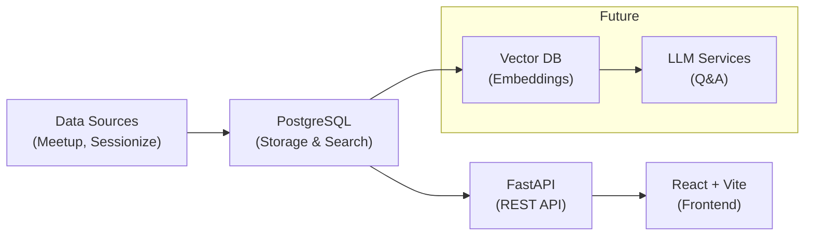

# Python Ireland Talk Database

A searchable database of Python Ireland conference talks and meetup events with intelligent tagging and filtering capabilities.

**🚀 Latest:** Migrated to PostgreSQL for enhanced tagging and simpler deployment!

---

## 🚀 Quick Start

### Prerequisites

- **PostgreSQL** (local install or Docker)
- **Node.js 20+** (for frontend)
- **Python 3.11+** with Pipenv (for backend)

### 1. Start PostgreSQL

```bash
# Option A: Using Docker (recommended)
docker run -d \
  --name postgres \
  -p 5432:5432 \
  -e POSTGRES_USER=postgres \
  -e POSTGRES_PASSWORD=password \
  -e POSTGRES_DB=talks_db \
  postgres:15

# Option B: Using local PostgreSQL
createdb talks_db

# Option C: Using docker-compose
docker-compose up postgres -d
```

### 2. Setup Backend

```bash
# Install dependencies and activate environment
pipenv install
pipenv shell

# Initialize PostgreSQL database and create tables
python scripts/init_postgres.py

# Start FastAPI server
cd backend
python run.py
```

### 3. Load Data

```bash
# Ingest talks from Sessionize (PyCon events) and Meetup
curl -X POST http://localhost:8000/api/v1/talks/ingest

# Verify data loaded
curl http://localhost:8000/api/v1/talks/search

# Check available taxonomies
curl http://localhost:8000/api/v1/talks/taxonomies
```

### 4. Start Frontend

```bash
# In a new terminal
cd frontend
npm install
npm run dev

# Open http://localhost:5173/explorer
```

You should now see the Talk Explorer with searchable/filterable Python Ireland talk data!

---

## 🛠 Technology Stack

**Backend:** FastAPI, PostgreSQL, Python 3.11  
**Frontend:** React, Vite, Material-UI, TypeScript  
**Data Sources:** Sessionize (PyCon events), Meetup API

---

## 📦 Frontend Development

### Prerequisites

- **Node.js 20+**: `node --version` should show 20.x or higher

### Setup

```bash
cd frontend
npm install

# Optional: Configure backend URL (defaults to http://localhost:8000)
echo "VITE_BACKEND_URL=http://localhost:8000" > .env

# Start development server
npm run dev
```

Open http://localhost:5173/explorer to see the Talk Explorer!

---

## 🔧 Advanced Usage & Testing

### API Examples

```bash
# Search talks by keyword
curl "http://localhost:8000/api/v1/talks/search?q=django"

# Filter by talk type
curl "http://localhost:8000/api/v1/talks/search?talk_types=pycon&talk_types=meetup"

# Get available taxonomies
curl http://localhost:8000/api/v1/talks/taxonomies

# Health check
curl http://localhost:8000/api/v1/talks/health
```

### Complete Pipeline Test

```bash
# Health check
curl http://localhost:8000/api/v1/talks/health

# Ingest all data (Sessionize + Meetup)
curl -X POST http://localhost:8000/api/v1/talks/ingest

# Search and filter
curl http://localhost:8000/api/v1/talks/search
curl "http://localhost:8000/api/v1/talks/search?talk_types=pycon"
curl "http://localhost:8000/api/v1/talks/search?q=django"
```

### Development Commands

```bash
# Run tests
bash scripts/test_postgres.sh

# Reset database (careful!)
python scripts/init_postgres.py
```

---

## 🎯 Project Vision & Roadmap

This project aims to become a comprehensive "intelligence platform" for Python Ireland, built in iterative phases:

### Phase A: Talk Content Explorer ✅

- **Current Status:** Complete with PostgreSQL migration
- **Features:** Search, filter, and tag conference talks and meetup events
- **Data Sources:** Sessionize (PyCon events) and Meetup API
- **Interface:** React-based Talk Explorer with detail drawers

### Phase B: Taxonomy Manager 🚧

- **Goal:** Structured tag management and hierarchy
- **Features:**
  - User-defined taxonomies with custom values
  - Tag metadata (colors, descriptions)
  - Multiple taxonomy support per talk
  - Drag-and-drop taxonomy builder

### Phase C: Analytics Dashboard 📋

- **Goal:** Data visualization and insights
- **Features:**
  - Tag distribution charts
  - Trends over time
  - Co-occurrence analysis
  - CSV/JSON export capabilities

### Future Vision 🚀

- **LLM Integration:** Q&A interface for talk content
- **Video Processing:** Automated transcription and tagging
- **Community Portal:** Speaker profiles, event management
- **Multi-Community:** Template for other Python communities

---

## 🏗️ Architecture



### Concentric Rings Pattern

- **Ring 1:** Pure Python business logic (`lib/engine/`)
- **Ring 2:** Database/API layer (`backend/database/`, `backend/services/`)
- **Ring 3:** Frontend React application (`frontend/`)

---

## 📚 Documentation

- **[Migration Guide](MIGRATION.md):** Detailed documentation of the Elasticsearch → PostgreSQL migration
- **[API Documentation](http://localhost:8000/docs):** Interactive API docs (when backend is running)
- **[Frontend README](frontend/README.md):** Frontend-specific setup and development notes
