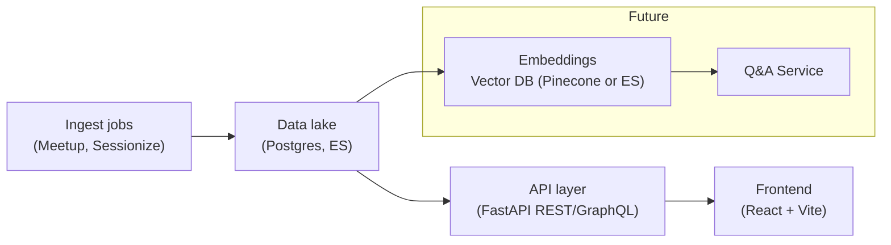

# python_ireland_talk_database

A modern “intelligence platform” for Python Ireland—aggregating all past talk and event metadata into a searchable, taggable, and analyzable system.

---

## 🎯 Vision & Phases

We’re building the first part in three iterative phases, with room to grow into a fuller information portal:

### Phase A: Talk Content Explorer

- **Goal:** Ingest Meetup & Sessionize data into Elasticsearch + Postgres, and build a React/Vite front‑end “Explorer”:
  - Filter by date, platform, full‑text search of titles & descriptions
  - Inline tagging of individual items
  - Detail drawer for full metadata (speakers, links, etc.)

### Phase B: Taxonomy Manager

- **Goal:** Curate the raw tags into a structured hierarchy:
  - Tag list with parent/child relationships
  - Drag‑and‑drop tree builder
  - Tag metadata (colors, descriptions, aliases)
  - Saved tag sets for quick filtering

### Phase C: Analytics Dashboard

- **Goal:** Slice & dice tagged content with charts and exports:
  - Tag distribution bar charts
  - Trends over time (multi‑line charts)
  - Co‑occurrence heatmaps
  - CSV/JSON export and alerts on tag‑volume changes

_Long‑term_, incorporate video data, extend this or add apps to integrate member/sponsor/speaker data (CRM) data, build a Q&A interface (with LLMs), and eventually package this as a drop‑in portal for other Python communities. Also could build a data lake to take full ownership of content, fly to the moon, etc.

---

## 🚀 Quick Start

### Prerequisites

- **Docker** (for Elasticsearch)
- **Node.js 20+** (for frontend)
- **Python 3.11+** with Pipenv (for backend)

### 1. Start Elasticsearch

You may need to play around with memory settings for your environment. There is also the option of a direct install on Linux.

```bash
# Start Elasticsearch with memory limits for local development
docker run -d \
  --name elasticsearch \
  -p 9200:9200 \
  -e "discovery.type=single-node" \
  -e "xpack.security.enabled=false" \
  -e "ES_JAVA_OPTS=-Xms256m -Xmx512m" \
  --memory=768m \
  --memory-swap=768m \
  elasticsearch:8.11.0

# Health check (may take 30+ seconds to start)
curl http://localhost:9200/
```

### 2. Start Backend

```bash
# Install dependencies and activate environment
pipenv install
pipenv shell

# Start FastAPI server
cd backend
python run.py
```

### 3. Load Data

```bash
# Ingest talks from Sessionize (PyCon events) and Meetup
curl -X POST http://localhost:8000/api/v1/talks/ingest

# Verify data loaded
curl http://localhost:8000/api/v1/talks/search
```

### 4. Start Frontend

```bash
# In a new terminal
cd frontend
npm install
npm run dev

# Open http://localhost:5173/explorer
```

You should now see the Talk Explorer with searchable/filterable Python Ireland talk data!

---

## 🛠 Technology Stack

**Backend:** FastAPI, Elasticsearch, Python 3.11  
**Frontend:** React, Vite, Material-UI, TypeScript  
**Data Sources:** Sessionize (PyCon events), Meetup API

---

## 🔧 API Examples

```bash
# Search talks
curl "http://localhost:8000/api/v1/talks/search?q=django"

# Filter by platform
curl "http://localhost:8000/api/v1/talks/search?talk_types=pycon&talk_types=meetup"

# Health check
curl http://localhost:8000/api/v1/talks/health
```

---

## 📦 Frontend: Install & Run

1. **Ensure Node 20+**:

   ```bash
   nvm install 20 # if you need to
   nvm use 20
   nvm alias default 20 #will keep it the active one between sessions
   node --version   # should be 20.x
   

   ```

2. **Install dependencies**:

   ```bash
   cd frontend
   npm install
   ```

3. **Configure backend URL** (optional, defaults to http://localhost:8000):
   Create a .env:
   `bash
echo "VITE_BACKEND_URL=http://localhost:8000" > .env
`
4. **Run the development server**:
   ```bash
   npm run dev
   ```
   Open http://localhost:5173/explorer to see the skeleton Explorer page.

## Backend:

### Start Elasticsearch in Docker

#### Create the Elasticsearch Docker network if you haven't already

```bash

# May need to limit memory for local dev at least, elastic is very memory hungry
docker run -d \
  --name elasticsearch \
  -p 9200:9200 \
  -e "discovery.type=single-node" \
  -e "xpack.security.enabled=false" \
  -e "ES_JAVA_OPTS=-Xms64m -Xmx128m" \
  -e "bootstrap.memory_lock=false" \
  -e "cluster.routing.allocation.disk.threshold_enabled=false" \
  --memory=256m \
  --memory-swap=256m \
  --cpus="0.25" \
  elasticsearch:8.11.0

```

#### Start Elasticsearch

```bash
docker start elasticsearch #NB it can take a while to start up, e.g. 30 seconds
curl http://localhost:9200/ #health check, should return a JSON response with cluster info
```

### Test the Data Retrieval Pipeline

#### 1. Start Elasticsearch If not Running

````bash
# lib/engine/elasticsearch_client.py - update README.md
## Test the Complete Pipeline


```bash
docker start elasticsearch
curl http://localhost:9200/  # Health check
````

#### 2. Start FastAPI Backend

```bash
pipenv install --dev # Install dependencies, just do once or when you expect changes
pipenv shell # Activate the virtual environment
cd backend
python run.py
```

### 3. Test Backend API & Frontend

```bash
# Health check
curl http://localhost:8000/api/v1/talks/health

# Ingest all data (Sessionize + Meetup)
curl -X POST http://localhost:8000/api/v1/talks/ingest

# Search all talks
curl http://localhost:8000/api/v1/talks/search

# Filter by type
curl "http://localhost:8000/api/v1/talks/search?talk_types=pycon"
curl "http://localhost:8000/api/v1/talks/search?talk_types=meetup"

# Search with query
curl "http://localhost:8000/api/v1/talks/search?q=django&talk_types=pycon&talk_types=meetup"

# Get available talk types
curl http://localhost:8000/api/v1/talks/types

# Run Frontend and browse talks in the Talk Explorer
# NB - you must run data ingestion step above first
cd frontend
npm run dev # Open http://localhost:5173/explorer
```

# Architecture



### LLM Integration (Future)

- **Goal:** Use LLMs to answer questions about the data, generate summaries, and provide insights.
