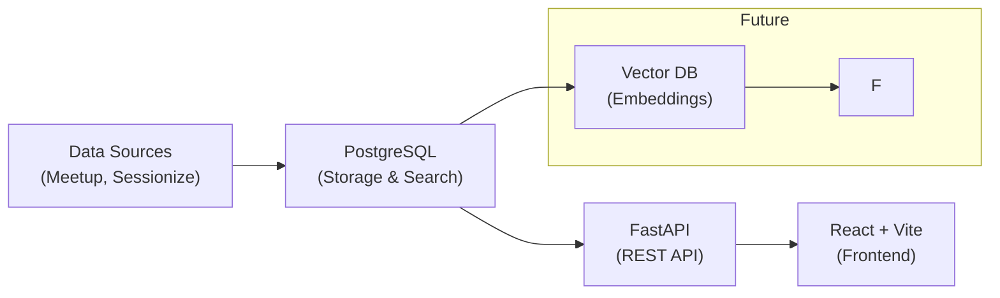

# Python Ireland Talk Database

A searchable database of Python Ireland conference talks and meetup events with intelligent tagging and filtering capabilities.

**🚀 Latest:** Migrated to PostgreSQL for enhanced tagging and simpler deployment!

---

## 🚀 Quick Start

Choose your preferred setup method:

### Option 1: Full Docker (Recommended)

**Perfect for:** First-time users, demos, consistent environments

```bash
# Start everything with one command
docker-compose up

# Visit the app at http://localhost:8000
# API docs at http://localhost:8000/docs
```

### Option 2: Local Development + Docker Database

**Perfect for:** Active development, faster iteration

```bash
# 1. Start just the database
docker-compose up postgres -d

# 2. Setup backend
pipenv install --dev && pipenv shell
python scripts/init_postgres.py
python -m backend.run

# 3. Setup frontend (new terminal)
cd frontend && npm install && npm run dev

# Backend: http://localhost:8000
# Frontend: http://localhost:5173
```

### Option 3: Manual Setup

**Perfect for:** Custom configurations, production deployments

Prerequisites: PostgreSQL, Python 3.11+, Node.js 20+

```bash
# Create database
createdb talks_db

# Configure environment
export DATABASE_URL="postgresql://localhost/talks_db"

# Follow Option 2 steps 2-3 above
```

---

## 🎯 Load Sample Data

After starting the backend:

```bash
# Load talks from conferences and meetups
curl -X POST http://localhost:8000/api/v1/talks/ingest

# Verify data loaded
curl http://localhost:8000/api/v1/talks/search
```

---

## 🛠 Technology Stack

**Backend:** FastAPI, PostgreSQL, Python 3.11  
**Frontend:** React, Vite, Material-UI, TypeScript  
**Data Sources:** Sessionize (PyCon events), Meetup API

---

## 🧪 Running Tests

```bash
# Run all tests (starts test database automatically)
pipenv run pytest

# Run specific test suites
pipenv run pytest tests/test_ring1.py -v        # Business logic
pipenv run pytest tests/test_postgres_client.py -v  # Database layer
```

---

## � API Usage

### Search Examples

```bash
# Search talks by keyword
curl "http://localhost:8000/api/v1/talks/search?q=django"

# Filter by talk type and tags
curl "http://localhost:8000/api/v1/talks/search?talk_types=pycon&tags=web"

# Get available events and taxonomies
curl "http://localhost:8000/api/v1/talks/events"
curl "http://localhost:8000/api/v1/talks/taxonomies"
```

**📚 Full API Documentation:** http://localhost:8000/docs

---

## 🎯 Project Status & Roadmap

### Phase 1: Talk Content Explorer ✅

- **Status:** Complete
- **Features:** Search, filter, and browse conference talks and meetup events
- **Data Sources:** Sessionize API (PyCon events) and Meetup API
- **Interface:** React-based explorer with detail views

### Phase 2: Taxonomy System ✅

- **Status:** Complete
- **Features:** Structured tag management with custom taxonomies
- **Implementation:** Multi-taxonomy support, colored tags, CRUD operations
- **Interface:** Management UI for taxonomies and values

### Phase 3: Analytics Dashboard 📋

- **Status:** Planned
- **Features:** Tag distribution charts, usage trends, data export
- **Implementation:** Visualization components and reporting

### Future Phases �

- **LLM Integration:** Natural language query interface
- **Video Processing:** Automated transcription and content analysis
- **Community Features:** Speaker profiles and event management

---

## 🏗️ Architecture



### Clean Architecture

The codebase follows Clean Architecture principles with clear separation of concerns:

**Layers:**

- **Enterprise Business Rules** (`lib/engine/`): Core domain logic for data processing and talk analysis
- **Application Business Rules** (`backend/domain/`, `backend/services/`): Use cases and domain models
- **Interface Adapters** (`backend/api/`, `backend/database/`): Controllers, presenters, and data access
- **Frameworks & Drivers** (`frontend/`): UI frameworks, databases, and external services

**Key Components:**

- **Domain Models** (`backend/domain/models.py`): Pydantic models representing business entities
- **Database Models** (`backend/database/models.py`): SQLAlchemy models with PostgreSQL-specific implementations
- **Services** (`backend/services/`): Application use cases and business logic orchestration
- **API Layer** (`backend/api/`): HTTP endpoints and request/response handling

**Directory Structure:**

```
lib/engine/           # Enterprise Business Rules: Core domain logic
backend/domain/       # Application Business Rules: Domain models
backend/services/     # Application Business Rules: Use cases
backend/database/     # Interface Adapters: Data persistence
backend/api/          # Interface Adapters: HTTP interface
frontend/             # Frameworks & Drivers: User interface
```

---

## 📚 Documentation

- **[Migration Guide](MIGRATION.md):** Detailed documentation of the Elasticsearch → PostgreSQL migration
- **[API Documentation](http://localhost:8000/docs):** Interactive API docs (when backend is running)
- **[Frontend README](frontend/README.md):** Frontend-specific setup and development notes
