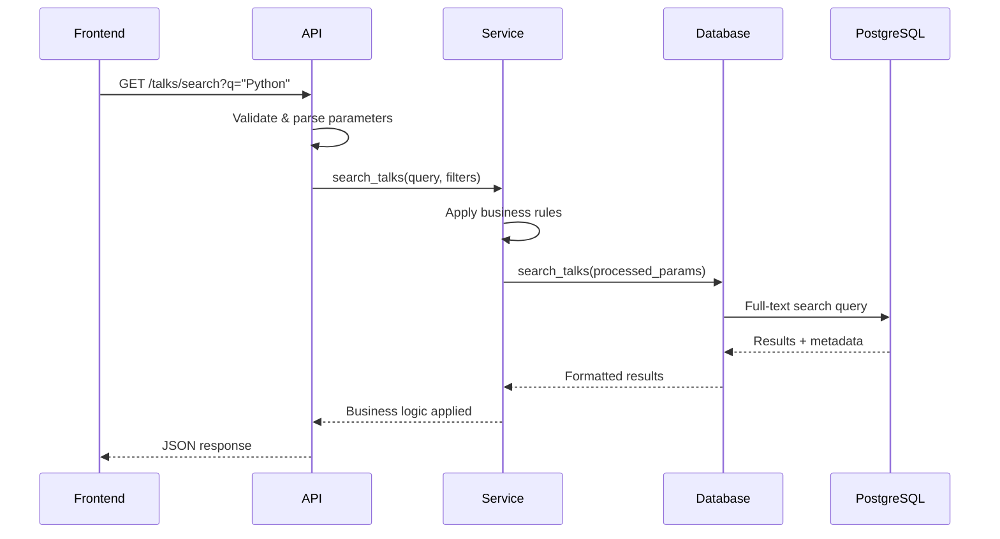
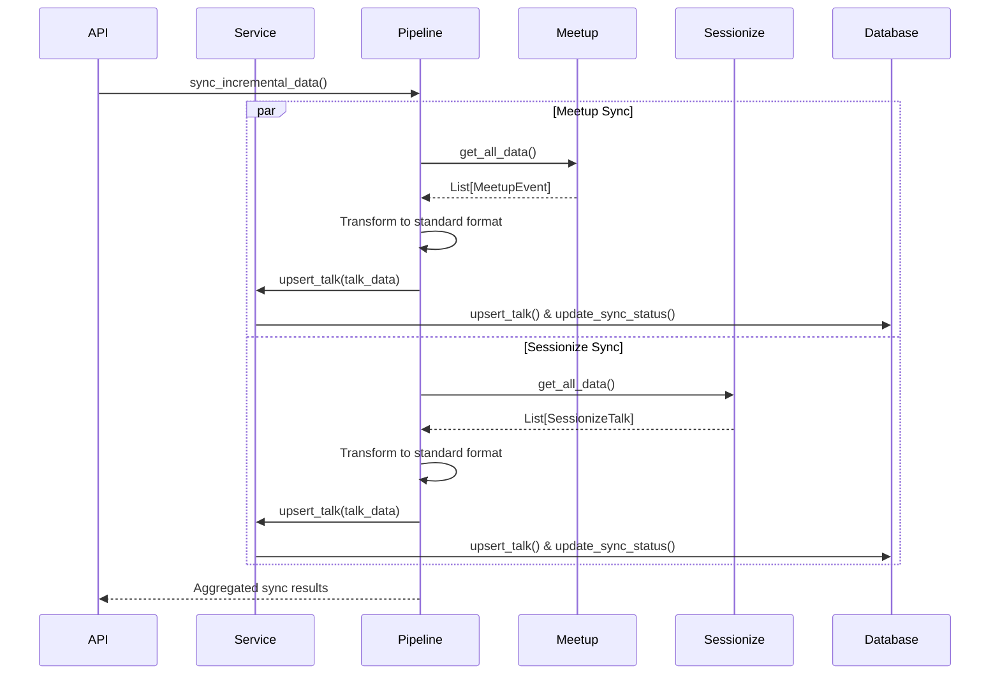
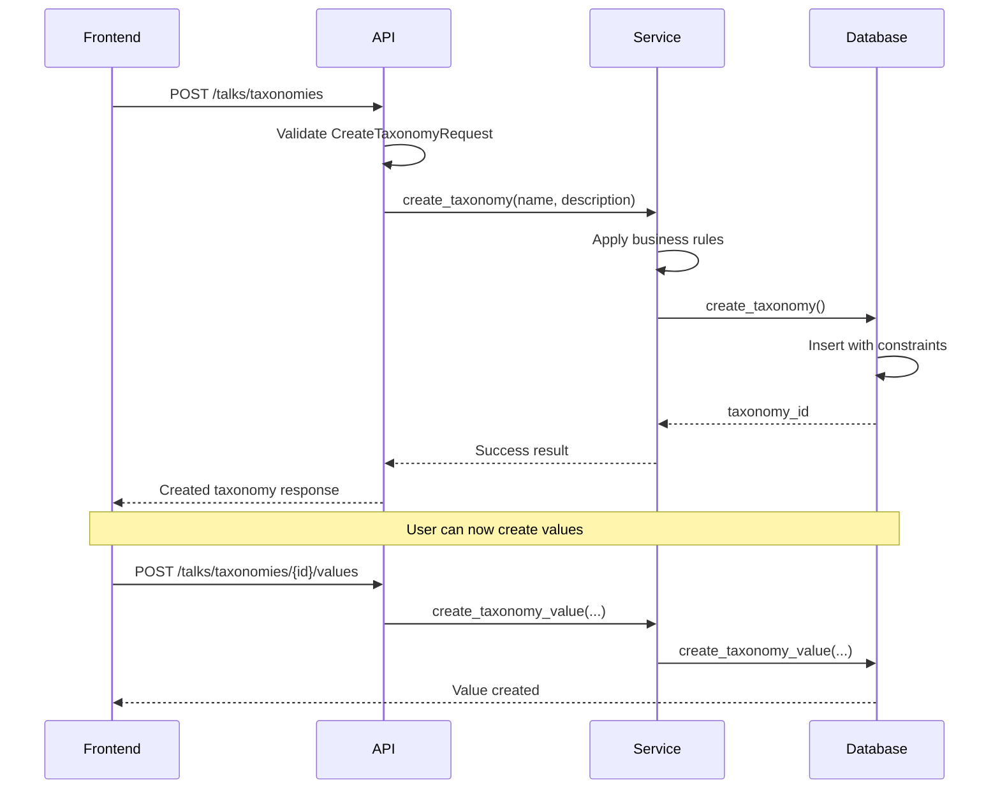

# Architecture Documentation

## Overview

The Python Ireland Talk Database follows **Clean Architecture** principles, ensuring separation of concerns, testability, and maintainability. The system is designed around concentric rings where inner rings contain business logic and outer rings contain implementation details.

### Clean Architecture Visualization

This diagram shows the **actual implementation** with the specific classes and components that have been built:

```mermaid
graph TD
    subgraph R1 ["🎯 Ring 1: Entities (Enterprise Business Rules)"]
        direction TB
        E1[Rich Domain Entities<br/>Talk, Taxonomy]
        E2[Domain Services<br/>TalkDomainService]
        E3[Pure Business Logic<br/>No Framework Dependencies]
    end

    subgraph R2 ["⚙️ Ring 2: Use Cases (Application Business Rules)"]
        direction TB
        U1[CreateTalkUseCase]
        U2[SearchTalksUseCase]
        U3[ManageTaxonomyUseCase]
    end

    subgraph R3 ["🔌 Ring 3: Interface Adapters"]
        direction TB
        I1[HTTP API Controllers<br/>FastAPI Routers]
        I2[Repository Interfaces<br/>TalkRepository]
        I3[Database Models<br/>SQLAlchemy ORM]
        I4[DTOs & Contracts<br/>Request/Response Models]
    end

    subgraph R4 ["🛠️ Ring 4: Frameworks & Drivers"]
        direction TB
        F1[PostgreSQL Database]
        F2[Repository Implementations<br/>PostgresTalkRepository]
        F3[External APIs<br/>Meetup, Sessionize]
        F4[React Frontend]
        F5[Application Services<br/>TalkService]
    end

    %% Dependencies point inward (Architecture rule)
    F2 --> I2
    F1 --> I2
    F3 --> F5
    F5 --> U1
    F5 --> U2
    F5 --> U3
    I1 --> U1
    I1 --> U2
    I1 --> U3
    U1 --> E1
    U1 --> E2
    U2 --> E1
    U2 --> E2
    U3 --> E1

    %% Styling
    classDef ring1 fill:#e3f2fd,stroke:#1976d2,stroke-width:2px,color:#000
    classDef ring2 fill:#f3e5f5,stroke:#7b1fa2,stroke-width:2px,color:#000
    classDef ring3 fill:#fff8e1,stroke:#f57c00,stroke-width:2px,color:#000
    classDef ring4 fill:#e8f5e8,stroke:#388e3c,stroke-width:2px,color:#000

    class E1,E2,E3 ring1
    class U1,U2,U3 ring2
    class I1,I2,I3,I4 ring3
    class F1,F2,F3,F4,F5 ring4
```



### Key Principles Shown:

1. **Dependencies point inward** - Outer rings depend on inner rings, never the reverse
2. **Actual classes** - This shows the actual components that have been built rather than generic placeholders
3. **Clean separation** - Each ring has a specific responsibility
4. **Framework independence** - The business logic (Rings 1 & 2) doesn't know about databases or web frameworks

**In Simple Terms:**

- **Ring 1**: Core business rules (what makes a talk valid, how auto-tagging works)
- **Ring 2**: Application workflows (how to create a talk, search talks)
- **Ring 3**: Translation layer (HTTP to business logic, business logic to database)
- **Ring 4**: External tools (PostgreSQL, React, APIs)

## Architecture Implementation

### **Project Structure:**

```
backend/domain/entities/        # Ring 1: Rich domain entities with business behavior
backend/domain/services/        # Ring 1: Pure business logic and domain services
backend/application/use_cases/  # Ring 2: Application business rules and use cases
backend/contracts/             # Ring 3: Repository interfaces and DTOs
backend/infrastructure/        # Ring 4: Repository implementations
backend/services/              # Ring 3: Service layer orchestration
backend/api/                   # Ring 3: HTTP controllers and API endpoints
backend/database/              # Ring 4: Database client and models
lib/engine/                    # Ring 4: External API clients and data pipeline
frontend/                      # Ring 4: React UI framework
```

### **Architecture Mapping:**

```
Ring 1 (Entities): backend/domain/entities/ + backend/domain/services/
Ring 2 (Use Cases): backend/application/use_cases/
Ring 3 (Interface Adapters): backend/contracts/ + backend/services/ + backend/api/
Ring 4 (Frameworks & Drivers): backend/infrastructure/ + backend/database/ + lib/engine/ + PostgreSQL + React
```

---

## Current Implementation Analysis

The codebase implements Clean Architecture principles with clear separation of concerns across four distinct rings:

---

## Ring 1: Enterprise Business Rules

**Location:** `backend/domain/entities/` and `backend/domain/services/`

### Domain Entities (`backend/domain/entities/`)

**Rich Domain Entities with Business Behavior:**

```python
# backend/domain/entities/talk.py
class Talk:
    """Rich domain entity with business behavior"""

    # Business methods
    def is_valid(self) -> bool:
        """Comprehensive business validation"""

    def add_speaker(self, speaker_name: str) -> None:
        """Business rule: add speaker with validation"""

    def update_content(self, title: str = None, description: str = None) -> None:
        """Business rule: update content and refresh metadata"""

    def has_keyword(self, keyword: str) -> bool:
        """Business rule: search for keyword in talk content"""

    def is_by_speaker(self, speaker_name: str) -> bool:
        """Business rule: check if talk is by specific speaker"""

    def get_duration_minutes(self) -> Optional[int]:
        """Business rule: extract duration from type-specific data"""

# backend/domain/entities/taxonomy.py
class Taxonomy:
    """Domain entity for classification systems"""

    def add_value(self, value: str, description: str = "", color: str = "") -> TaxonomyValue:
        """Business rule: add new taxonomy value with validation"""

    def find_value_by_name(self, value_name: str) -> Optional[TaxonomyValue]:
        """Business rule: find value by name (case-insensitive)"""
```

### Domain Services (`backend/domain/services/`)

**Pure Business Logic Services:**

```python
# backend/domain/services/talk_domain_service.py
class TalkDomainService:
    """Pure business logic for talks - Entities Layer (Ring 1)"""

    @staticmethod
    def extract_auto_tags(title: str, description: str) -> List[str]:
        """Business rule: intelligent content analysis and tagging"""
        # 6 categories: AI/ML, Web Dev, Data Science, Testing, DevOps, Python Core

    @staticmethod
    def determine_talk_type(source_type: str, session_data: Dict[str, Any]) -> str:
        """Business rule: determine talk type from session data"""

    @staticmethod
    def validate_talk_data(talk_data: Dict[str, Any]) -> List[str]:
        """Business rule: comprehensive talk data validation"""

    @staticmethod
    def should_update_talk(existing_talk: Dict, new_talk: Dict) -> bool:
        """Business rule: determine if talk should be updated"""

    @staticmethod
    def normalize_speaker_names(speaker_names: List[str]) -> List[str]:
        """Business rule: standardize speaker name format"""
```

**Key Characteristics:**

- Zero external dependencies
- Pure business logic
- Framework-agnostic
- Comprehensive business rules

---

## Ring 2: Application Business Rules

**Locations:** `backend/application/use_cases/` and `backend/services/`

### Use Cases (`backend/application/use_cases/`)

**Clean Use Case Implementation:**

```python
# backend/application/use_cases/create_talk.py
class CreateTalkUseCase:
    """Use case for creating a new talk - Ring 2"""

    def __init__(self, talk_repository: TalkRepository, domain_service: TalkDomainService):
        self.talk_repository = talk_repository
        self.domain_service = domain_service

    def execute(self, talk_data: Dict[str, Any]) -> str:
        """Create a new talk with business validation"""
        # 1. Validate using domain service
        # 2. Create domain entity
        # 3. Apply business rules
        # 4. Enhance with auto-tags
        # 5. Persist through repository

# Additional use cases:
# - SearchTalksUseCase: Complex search with business logic
# - UpdateTalkUseCase: Talk lifecycle management
# - ManageTaxonomyUseCase: Classification management
```

**Key Responsibilities:**

- Pure application business rules
- Use case orchestration
- Framework-independent workflows
- Domain service coordination

---

## Ring 3: Interface Adapters

**Locations:** `backend/contracts/`, `backend/api/`, `backend/services/`, database adapters

> **⚠️ Note on TalkService Architecture:**
> Currently `TalkService` (classified as Ring 4) directly instantiates concrete dependencies like `PostgresTalkRepository`. This creates a dependency inversion violation since it bypasses the interfaces. For stricter Clean Architecture compliance, we could:
>
> 1. Move `TalkService` to Ring 3 and use dependency injection
> 2. Pass repository interfaces through constructor instead of concrete implementations
>
> The current approach works but represents a pragmatic compromise over pure Clean Architecture.

### Repository Interfaces (`backend/contracts/repositories.py`)

**Clean Abstraction Contracts:**

```python
class TalkRepository(ABC):
    """Repository interface defining data access contract"""

    @abstractmethod
    def save(self, talk: Talk) -> str:
        """Save talk and return ID"""

    @abstractmethod
    def find_by_id(self, talk_id: str) -> Optional[Talk]:
        """Find talk by ID"""

    @abstractmethod
    def search(self, query: str, filters: Dict[str, Any]) -> Tuple[List[Talk], int]:
        """Search talks with filters"""

class TaxonomyRepository(ABC):
    """Repository interface for classification management"""
    # Similar clean interface definition
```

### HTTP Controllers (`backend/api/routers/talks.py`)

**RESTful API with Clean Architecture:**

```python
# Talk operations
GET    /talks/                     # List talks with filtering
GET    /talks/search               # Full-text search with business logic
GET    /talks/{id}                 # Get specific talk
POST   /talks/sync                 # Trigger use case orchestration

# Taxonomy management
GET    /talks/taxonomies           # List taxonomies
POST   /talks/taxonomies           # Create via use case
PUT    /talks/taxonomies/{id}      # Update via use case
```

### Request/Response DTOs (`backend/contracts/dtos.py`)

**Proper Interface Contracts:**

```python
# API contracts (correctly placed as DTOs)
class CreateTaxonomyRequest(BaseModel): ...   # HTTP request DTO
class TalkSearch(BaseModel): ...              # Search parameters DTO
class BaseTalk(BaseModel): ...                # Response DTO

# Domain enums
class TalkType(Enum):
    CONFERENCE_TALK = "conference_talk"
    LIGHTNING_TALK = "lightning_talk"
    WORKSHOP = "workshop"
    KEYNOTE = "keynote"
    MEETUP = "meetup"
    PYCON = "pycon"
    GENERAL_TALK = "talk"
```

---

## Ring 4: Frameworks & Drivers

**Locations:** `backend/infrastructure/`, `backend/database/`, `lib/engine/`, PostgreSQL, React

### Repository Implementations (`backend/infrastructure/repositories/`)

**Clean Infrastructure Implementation:**

```python
# backend/infrastructure/repositories/postgres_talk_repository.py
class PostgresTalkRepository(TalkRepository):
    """PostgreSQL implementation of TalkRepository - Ring 4"""

    def __init__(self, postgres_client: PostgresClient):
        self.db = postgres_client

    def save(self, talk: Talk) -> str:
        """Convert domain entity to database format and persist"""
        talk_data = self._entity_to_db_format(talk)
        return self.db.index_talk(talk_data)

    def find_by_id(self, talk_id: str) -> Optional[Talk]:
        """Retrieve from database and convert to domain entity"""
        db_talk = self.db.get_talk(talk_id)
        return self._db_to_entity_format(db_talk) if db_talk else None

    def _entity_to_db_format(self, talk: Talk) -> Dict[str, Any]:
        """Clean conversion between domain and persistence"""
        return talk.to_dict()
```

### Database Gateway (`backend/database/postgres_client.py`)

**PostgreSQL-specific implementation:**

```python
class PostgresClient:
    """PostgreSQL adapter implementing data persistence"""

    # CRUD operations
    def index_talk(talk_data: Dict) -> str
    def get_talk(talk_id: str) -> Optional[Dict]
    def search_talks(...) -> Tuple[List[Dict], int]
    def delete_all_talks() -> bool

    # Advanced search
    def search_talks_advanced(...) -> Tuple[List[Dict], int]

    # Taxonomy operations
    def create_taxonomy(...) -> Optional[int]
    def get_taxonomies() -> List[Dict]
    def create_taxonomy_value(...) -> Optional[int]

    # Synchronization support
    def upsert_talk(talk_data: Dict) -> Optional[str]
    def get_talk_by_source(...) -> Optional[Dict]
    def get_sync_status(source_type: str) -> Optional[Dict]
    def update_sync_status(...) -> bool
```

**PostgreSQL-Specific Features:**

- Full-text search with GIN indexes
- JSONB storage for flexible schemas
- Complex relationship queries
- Performance optimizations
- Migration support

### Application Services (`backend/services/talk_service.py`)

**Current Implementation (Ring 4 Classification):**

```python
class TalkService:
    """Service layer with concrete dependencies - Ring 4"""

    def __init__(self, postgres_client: Optional[PostgresClient] = None):
        # Direct instantiation of concrete implementations
        self.domain_service = TalkDomainService()
        self.talk_repository = PostgresTalkRepository(self.db)

        # Use case initialization
        self.create_talk_use_case = CreateTalkUseCase(
            self.talk_repository, self.domain_service
        )

    def create_talk(self, talk_data: Dict[str, Any]) -> str:
        """Delegate to use case"""
        return self.create_talk_use_case.execute(talk_data)
```

> **Note:** This service is classified as Ring 4 because it directly instantiates concrete dependencies rather than using dependency injection with interfaces.

### External API Clients (`lib/engine/`)

**Properly Isolated External Dependencies:**

**Meetup Integration (`lib/engine/meetup.py`):**

```python
class Meetup:
    """External API client - Ring 4 driver"""
    def get_all_data() -> List[MeetupEvent]
    def get_group_events(group_name: str) -> List[MeetupEvent]
    # GraphQL API calls, HTTP requests, JSON parsing
```

**Sessionize Integration (`lib/engine/sessionize.py`):**

```python
class Sessionize:
    """External API client - Ring 4 driver"""
    def get_all_data() -> List[SessionizeTalk]
    def get_event_data(event_id: str) -> List[SessionizeTalk]
    # REST API calls, HTTP requests, JSON parsing
```

**Data Pipeline (`lib/engine/data_pipeline.py`):**

```python
class DataPipeline:
    """Coordinates external data sources with domain logic"""

    def sync_incremental_data(self) -> Dict[str, Any]:
        # Uses domain services for business logic
        # Delegates to use cases for persistence
        # Clean separation maintained
```

### Database (PostgreSQL)

**Production-Ready Database Layer:**

**Configuration:**

- PostgreSQL 15 with optimized settings
- Docker containerization for consistency
- Separate test database (port 5433)
- Performance tuning for full-text search

**Schema Design:**

```sql
-- Core tables
talks                 # Main talk storage with JSONB
taxonomies           # Classification categories
taxonomy_values      # Specific taxonomy values
sync_status          # Synchronization tracking

-- Association tables
talk_taxonomy_values # Many-to-many talk-tag relationships

-- Indexes
idx_talks_search     # GIN index for full-text search
idx_talks_type       # Talk type filtering
idx_talks_source     # Source-based queries
```

---

## Implementation Details

### Web Framework (FastAPI)

**Features:**

- Automatic OpenAPI documentation
- Async request handling
- Dependency injection system
- Pydantic integration for validation
- CORS middleware for frontend integration

**Configuration:**

```python
# Dependency injection
def get_talk_service() -> TalkService:
    return TalkService()

# Middleware
app.add_middleware(CORSMiddleware, ...)

# Route organization
app.include_router(talks_router, prefix="/api/v1/talks")
```

### Frontend (React + Vite)

**Architecture:**

```
src/
├── components/       # Reusable UI components
├── pages/           # Route-based page components
├── services/        # API client logic
├── contexts/        # React context providers
├── types/           # TypeScript type definitions
└── utils/           # Utility functions
```

**Technology Stack:**

- React 18 with TypeScript
- Material-UI for consistent design
- Vite for fast development builds
- Axios for API communication

---

## Technology Stack

---

## Data Flow Patterns

### 1. Search Request Flow



### 2. Data Synchronization Flow



### 3. Taxonomy Management Flow



---

## Testing Architecture

### Test Structure

```
tests/
├── conftest.py              # Shared fixtures and test configuration
├── test_ring1.py           # Enterprise business rules tests
├── test_postgres_client.py # Database layer tests
├── test_taxonomy_api.py    # API layer tests
├── test_taxonomy_service.py # Service layer tests
└── test_taxonomy_database.py # Database integration tests
```

### Test Database Management

**Automatic PostgreSQL Container:**

```python
@pytest.fixture(scope="session")
def ensure_test_db():
    """Automatically manages test PostgreSQL container"""
    # Start postgres:15 on port 5433
    # Wait for readiness
    # Yield for tests
    # Cleanup on completion
```

**Test Isolation:**

```python
@pytest.fixture
def postgres_client(test_database_url, ensure_test_db):
    """Provides clean database for each test"""
    client = PostgresClient(test_database_url)
    client.init_database()
    client.delete_all_talks()  # Clean slate
    yield client
    client.delete_all_talks()  # Cleanup
```

### FastAPI Testing

**In-Process Testing:**

```python
@pytest.fixture
def api_client(postgres_client):
    """FastAPI TestClient with dependency override"""
    app.dependency_overrides[get_talk_service] = lambda: TalkService(postgres_client)
    return TestClient(app)
```

**Benefits:**

- No network overhead (in-process)
- Real application code testing
- Dependency injection for isolation
- Fast execution

---

## Deployment Architecture

### Development Environment

**Docker Compose Setup:**

```yaml
services:
  postgres: # PostgreSQL 15 on port 5432
  backend: # FastAPI on port 8000
  frontend: # Vite dev server on port 5173
```

**Local Development:**

```bash
# Option 1: Full Docker
docker-compose up

# Option 2: Local dev + Docker DB
docker-compose up postgres -d
python -m backend.run      # Backend on 8000
npm run dev               # Frontend on 5173
```

### Production Considerations

**Database:**

- PostgreSQL with connection pooling
- Read replicas for scaling
- Backup and recovery procedures
- Performance monitoring

**API:**

- Load balancing for multiple instances
- Caching layer for frequent queries
- Rate limiting and authentication
- Monitoring and logging

**Frontend:**

- Static asset optimization
- CDN for global distribution
- Environment-specific configuration

---

## Key Design Decisions

### 1. Clean Architecture Adoption

**Why:** Ensures long-term maintainability and testability by enforcing dependency inversion and separation of concerns.

**Implementation:** Strict layering with dependency injection throughout.

### 2. PostgreSQL Over Elasticsearch

**Why:** Simplified deployment, better transaction support, native full-text search capabilities.

**Trade-offs:** Slightly more complex search queries but much simpler operational overhead.

### 3. Pydantic for Domain Models

**Why:** Type safety, automatic validation, excellent IDE support, framework independence.

**Benefits:** Catch errors early, self-documenting APIs, seamless JSON serialization.

### 4. FastAPI for HTTP Layer

**Why:** Modern async support, automatic documentation, excellent type integration.

**Benefits:** High performance, developer productivity, standards compliance.

### 5. Incremental Synchronization

**Why:** Efficient data updates, reduced API load, better user experience.

**Implementation:** Source tracking, timestamp comparison, differential updates.

---

## Extension Points

### Adding New Data Sources

1. **Create source adapter** in `lib/engine/new_source.py`
2. **Add transformation logic** in `DataPipeline`
3. **Update domain models** if needed
4. **Add sync tracking** in database
5. **Update API endpoints** for source-specific operations

### Adding New Features

1. **Define domain models** in `backend/domain/models.py`
2. **Implement use cases** in `backend/services/`
3. **Add database operations** in `backend/database/`
4. **Create API endpoints** in `backend/api/routers/`
5. **Update frontend** components

### Performance Optimizations

1. **Database indexing** for new query patterns
2. **Caching layer** for frequent operations
3. **Background jobs** for heavy processing
4. **API pagination** for large datasets
5. **Database query optimization**

This architecture provides a solid foundation for growth while maintaining code quality and system reliability.
